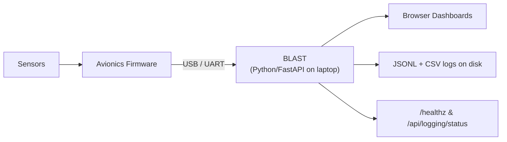
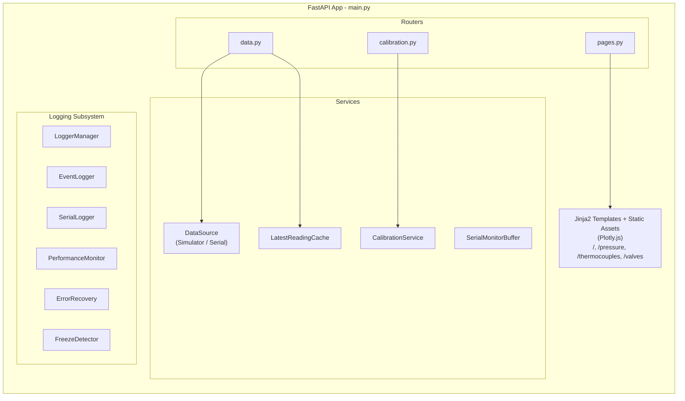

# RPL‑BLAST Onboarding Guide

Welcome to **BLAST** — the Big Launch Analysis & Stats Terminal. This document walks you through every layer of the system so you can get productive quickly, whether you're working on firmware integration, backend services, frontend dashboards, data analysis, or DevOps.

---

## Table of Contents

1. [What BLAST Does](#what-blast-does)
2. [System Context](#system-context)
3. [Prerequisites](#prerequisites)
4. [Setup & First Run](#setup--first-run)
5. [Architecture Overview](#architecture-overview)
6. [Configuration System](#configuration-system)
7. [Backend Deep Dive](#backend-deep-dive)
8. [Frontend Deep Dive](#frontend-deep-dive)
9. [Logging & Observability](#logging--observability)
10. [Serial Protocol & Firmware Interface](#serial-protocol--firmware-interface)
11. [Calibration System](#calibration-system)
12. [API Reference](#api-reference)
13. [CI & Testing](#ci--testing)
14. [First Week Checklist](#first-week-checklist)
15. [Short Roadmap](#short-roadmap)
16. [Quick Links](#quick-links)

---

## What BLAST Does

BLAST is a **ground‑side telemetry display and logging tool**. It:

- Reads sensor data from a flight computer over USB/UART serial, or generates simulated data for development.
- Applies user‑configurable calibration offsets server‑side (zero, set, reset).
- Serves real‑time browser dashboards with live Plotly charts for pressure transducers, thermocouples, load cells, and valve states.
- Provides a Serial Monitor panel on every page to inspect raw data packets.
- Writes structured JSONL and CSV logs partitioned by run for post‑test analysis.
- Exposes health, performance, and freeze‑detection diagnostics via API.

**What BLAST is not:** It does not control hardware, manage mission state, perform GNC, or handle uplink/downlink. It is read‑only ground‑side display and logging.

---

## System Context



- **Inputs:** JSON lines from firmware (one per frame) over a serial port, or internally generated simulator data.
- **Outputs:** HTML dashboards, REST API (JSON), disk logs.
- **Scope:** Passive observer — BLAST never sends commands to hardware.

---

## Prerequisites

| Requirement | Notes |
|-------------|-------|
| Python 3.9+ | Used by the backend (FastAPI + Uvicorn). |
| Git | For cloning the repo. |
| Conda or micromamba | The one‑click scripts use micromamba automatically; manual setup can use Conda. |
| Serial hardware (optional) | Only needed to test real serial data. Requires OS‑level port permissions. |
| Modern browser | Chrome, Firefox, or Edge for the dashboards. |

---

## Setup & First Run

### Option A — One‑Click Scripts (Recommended)

These scripts install micromamba locally, create a project‑scoped `.venv`, and install all Python deps from `requirements.txt`. No global changes.

**macOS:**
```bash
# One-time setup
scripts/Setup Mac.command       # double-click in Finder, or: bash scripts/setup_mac.sh

# Start the app
scripts/Start App.command       # or: bash scripts/start_mac.sh
```

If macOS Gatekeeper blocks execution:
```bash
bash scripts/fix_permissions_mac.sh
```

**Windows:**
```powershell
# One-time setup
scripts\setup_win.bat           # double-click, or: powershell scripts\setup_win.ps1

# Start the app
scripts\start_win.bat           # or: powershell scripts\start_win.ps1
```

**Uninstall** (removes `.venv` + local micromamba only):
- macOS: `scripts/Uninstall Mac.command`
- Windows: `scripts\uninstall_win.bat`

### Option B — Manual (Conda)

```bash
conda env create -f environment.yaml
conda activate RPL
uvicorn backend.app.main:app --reload
```

### Option C — Manual (pip + venv)

```bash
python -m venv .venv
# Activate:
#   Windows:  .venv\Scripts\activate
#   macOS:    source .venv/bin/activate
pip install -r requirements.txt
uvicorn backend.app.main:app --reload
```

Once running, open **http://127.0.0.1:8000** in your browser.

---

## Architecture Overview

BLAST follows a clean **backend ↔ frontend** split, all served from a single FastAPI process.



### Data Flow

1. **Startup:** `main.py` creates the FastAPI app, loads layered config, initializes calibration, selects the data source (simulator or serial), performs an initial read, and spawns an async `reader_loop` task.
2. **Reader Loop:** Runs at ~10 Hz (`update_interval_s = 0.1`). Each iteration:
   - Calls `source.read_once()` to get raw sensor values + timestamp.
   - Applies calibration offsets via `_apply_offsets()`.
   - Stores the full snapshot (raw, adjusted, offsets, timestamp, value) in `LatestReadingCache`.
   - Logs data to the comprehensive logging system (JSONL + CSV) and legacy JSONL.
   - Reports performance metrics and heartbeats to the freeze detector.
3. **Browser Polling:** Frontend JS polls `GET /data` at a regular interval, receives the latest cached snapshot, and updates Plotly charts + stats cards in place.
4. **Shutdown:** Cancels the reader task, stops monitoring systems, writes a run summary.

---

## Configuration System

BLAST uses a **layered YAML config** approach — a mandatory base file plus optional user overrides.

### Config Files

| File | Git‑tracked? | Purpose |
|------|:---:|---------|
| `frontend/app/config.base.yaml` | ✅ | Shared defaults — sensor definitions, serial settings, boundaries. |
| `frontend/app/config.user.yaml` | ❌ | Your local overrides (serial port, data source, custom sensor names). Copy from `config.user.yaml.example`. |
| `frontend/app/config.ci.yaml` | ✅ | CI‑specific fallback config. |

### How Loading Works (`backend/app/config/loader.py`)

1. Looks for `config.base.yaml`. If found, loads it as the base.
2. If `config.user.yaml` exists, deep‑merges it on top (user keys override base keys recursively).
3. If no base file exists, falls back to the legacy single `config.yaml`.
4. Parses the merged data into a `Settings` dataclass.

### `Settings` Dataclass Fields

```python
@dataclass
class Settings:
    DATA_SOURCE: str                    # "simulator" or "serial"
    SERIAL_PORT: str                    # e.g. "COM4", "/dev/cu.usbmodem1301"
    SERIAL_BAUDRATE: int                # e.g. 115200

    PRESSURE_TRANSDUCERS: List[Dict]    # [{name, id, color, min_value, max_value, ...}, ...]
    NUM_PRESSURE_TRANSDUCERS: int
    THERMOCOUPLES: List[Dict]
    NUM_THERMOCOUPLES: int
    LOAD_CELLS: List[Dict]
    NUM_LOAD_CELLS: int
    FLOW_CONTROL_VALVES: List[Dict]
    NUM_FLOW_CONTROL_VALVES: int

    TEMPERATURE_BOUNDARIES: Dict        # {safe: [lo, hi], warning: [...], danger: [...]}
    PRESSURE_BOUNDARIES: Dict
    LOAD_CELL_BOUNDARIES: Dict
```

### Currently Configured Sensors (in `config.base.yaml`)

**Pressure Transducers (7):** GN2, LOX, LNG, LNG Downstream, LOX Downstream, LOG DOME, LNG DOME

**Thermocouples (3):** Thermocouple 1, Thermocouple 2, Cryo Thermocouple (Cold Flow)

**Load Cells (3):** Load Cell 1, Load Cell 2, Load Cell 3

**Flow Control Valves (7):** LNG Vent, LOX Vent, GN2 Vent, LNG Flow, LOX Flow, GN2‑LNG Flow, GN2‑LOX Flow

---

## Backend Deep Dive

### Entry Point — `backend/app/main.py`

The `create_app()` factory:
1. Asserts the expected filesystem layout (`assert_legacy_layout()`).
2. Loads the layered config.
3. Creates the FastAPI app and initializes all logging components.
4. Mounts static files at `/static`.
5. Includes three routers: `data`, `pages`, `calibration`.
6. Registers `startup` / `shutdown` lifecycle events.

### Routers

#### `routers/data.py`
- **`GET /data`** — Returns the latest cached snapshot. Accepts `?type=` to filter to a single sensor group. Wraps the response in a `DataEnvelope` Pydantic model.
- **`POST /api/browser_heartbeat`** — Stub endpoint for browser activity monitoring.
- **`POST /api/browser_status`** — Stub endpoint for browser tab status.
- **`GET /api/serial/logs?after=-1`** — Returns raw serial lines from the `SerialMonitorBuffer` ring buffer. Supports incremental polling via the `after` index parameter.

#### `routers/calibration.py`
- **`GET /api/offsets`** — Returns the current offset map.
- **`PUT /api/offsets`** — Partial update (merge).
- **`POST /api/zero/{sensor_id}`** — Zeroes one sensor (offset = −raw).
- **`POST /api/zero_all`** — Zeroes all sensors.
- **`POST /api/reset_offsets`** — Resets all offsets to 0.0.

Internally uses `_lookup_raw_by_id` and `_flatten_raw_by_id` helpers to map sensor IDs (e.g., `pt1`, `tc2`) to their array positions using the settings.

#### `routers/pages.py`
- Serves Jinja2‑rendered HTML pages for `/`, `/pressure`, `/thermocouples`, `/valves`.
- Injects `config` (Settings) and a `url_for` shim that translates Flask‑style `url_for('static', filename=...)` to FastAPI's `request.url_for('static', path=...)`.

### Services

#### `services/data_source.py` — `DataSource` Protocol, `SimulatorSource`, `SerialSource`

**`DataSource` Protocol:**
```python
class DataSource(Protocol):
    def initialize(self) -> None: ...
    def read_once(self) -> Tuple[Dict, float]: ...
    def shutdown(self) -> None: ...
```

**`SimulatorSource`:**
- Generates random sensor values within configured min/max ranges.
- GN2 pressure transducer uses a 25‑second sine wave + noise for realistic demo behavior.
- Writes formatted JSON packets to the `SerialMonitorBuffer` so the Serial Monitor works even in simulator mode.

**`SerialSource`:**
- Opens a PySerial connection to the configured port/baud.
- `read_once()` reads one line if data is available, calls `_parse_and_update()`, and returns the latest snapshot. On transient errors, keeps the last‑known values.
- `_parse_and_update()` expects JSON lines of the form: `{"value": {"pt": [...], "tc": [...], "lc": [...], "fcv": [...]}}`.
- Supports an optional `_convert_pt_voltage_to_psi()` conversion if `PT_CONVERSION` is configured.
- Writes every raw line to the `SerialMonitorBuffer`.

#### `services/calibration.py` — `CalibrationStore`, `CalibrationService`

- **`CalibrationStore`** — YAML file persistence with atomic writes (temp file + `os.replace`), with a fallback to direct writes for restricted filesystems (e.g., OneDrive).
- **`CalibrationService`** — Thread‑safe in‑memory offset map with `get`, `set`, `zero`, `zero_all`, and `reset` operations.
- On startup, `initialize()` builds a fresh offset map with all sensor IDs set to `0.0` and saves it.

#### `services/reading_cache.py` — `LatestReadingCache`

Thread‑safe snapshot holder. The reader loop writes via `set_full()`, and the `/data` endpoint reads via `get_full()`. Stores only the latest reading — no history.

#### `services/serial_monitor.py` — `SerialMonitorBuffer`

A thread‑safe ring buffer (`collections.deque`, default maxlen=1000) that stores every raw data packet. Each entry has `{index, timestamp, raw, source}`. The frontend polls `GET /api/serial/logs?after=<last_index>` for incremental updates.

### Schemas

#### `schemas/data.py` — `DataEnvelope`

```python
class DataEnvelope(BaseModel):
    value: Optional[Dict[str, Any]]
    timestamp: Optional[float]
    raw: Optional[Dict[str, Any]] = None
    adjusted: Optional[Dict[str, Any]] = None
    offsets: Optional[Dict[str, float]] = None
```

Uses `model_config = ConfigDict(extra="forbid")` to reject unexpected fields.

---

## Frontend Deep Dive

### Templates (`frontend/app/templates/`)

All templates extend `base.html`, which provides:
- A header with the BLAST title, current page name, a Serial Monitor toggle button, and a "Back to Dashboard" nav link (shown on subpages).
- Loads `dashboard.css`, Plotly.js (CDN), `serial_monitor.js`, and `browser_monitor.js`.

| Template | Route | Includes |
|----------|-------|----------|
| `index.html` | `/` | Navigation cards linking to Thermocouples, Pressure, and Valves pages. |
| `pressure.html` | `/pressure` | Injects `Config` JS object with PT definitions. Loads `pt_config.js`, `pt_line.js`, `pt_agg.js`, `pt_stats.js`, `calibration.js`. Renders stats cards server‑side (Jinja loop). |
| `thermocouples.html` | `/thermocouples` | Injects TC + LC config. Loads `tc_agg.js`, `tc_subplots.js`, `tc_stats.js`, `lc_agg.js`, `lc_subplots.js`, `lc_stats.js`, `calibration.js`. |
| `valves.html` | `/valves` | Injects FCV config. Loads `valves.js` and `get_data.js`. Renders a 2×4 grid with a centered "BLAST Phoenix" branding card. |

### JavaScript Modules (`frontend/app/static/js/`)

| Module | Purpose |
|--------|---------|
| `get_data.js` | Shared helper to poll `GET /data` and dispatch values to callbacks. |
| `pt_config.js` | Plotly layout/config constants for pressure charts. |
| `pt_line.js` | Creates and updates per‑sensor line subplots (one chart per PT). |
| `pt_agg.js` | Aggregate overlay chart with all PTs on one plot. |
| `pt_stats.js` | Updates stat cards (latest, 10s avg, rate, max). |
| `tc_agg.js` | TC aggregate chart. |
| `tc_subplots.js` | TC per‑sensor subplots. |
| `tc_stats.js` | TC stats updater. |
| `lc_agg.js` | LC aggregate chart. |
| `lc_subplots.js` | LC per‑sensor subplots. |
| `lc_stats.js` | LC stats updater. |
| `calibration.js` | Renders calibration UI controls (zero, set offset, reset) below the plots. |
| `valves.js` | Polls valve data and toggles CSS classes for on/off indicator styling. |
| `serial_monitor.js` | Builds the serial monitor panel, polls `/api/serial/logs`, handles auto‑scroll (only scrolls if user is at the bottom). |
| `browser_monitor.js` | Sends periodic heartbeats and status updates to the backend. |
| `charts.js` | Minimal chart utility helpers. |

### Styles (`frontend/app/static/css/dashboard.css`)

A single CSS file covering all pages — layout grids, header, nav cards, stat blocks, valve grid, serial monitor panel, Plotly container sizing, and responsive adjustments.

---

## Logging & Observability

### Subsystem Components (`backend/app/logging/`)

| Component | File | Responsibilities |
|-----------|------|-----------------|
| **LoggerManager** | `logger_manager.py` | Creates a timestamped run directory under `frontend/logs/`. Writes `data.jsonl` and `data.csv` per run. Creates a `latest` symlink (best‑effort). Produces a `run_summary.json` on shutdown. |
| **EventLogger** | `event_logger.py` | Structured event logs: data source changes, system state transitions, startup/shutdown events. |
| **SerialLogger** | `serial_logger.py` | Logs serial connection attempts/results and every data read (success/failure, port, raw content). |
| **PerformanceMonitor** | `performance_monitor.py` | Start/end timer‑based measurements for operations like `data_read` and `api_logging_status`. Tracks data lag in milliseconds. |
| **ErrorRecovery** | `error_recovery.py` | Categorizes and counts errors. Exposes `health_check()` for the logging status API. |
| **FreezeDetector** | `freeze_detector.py` | Heartbeat‑based watchdog. Expects heartbeats from named loops (`data_acquisition`, `serial_communication`, `api_requests`). Detects stalls and reports via `health_check()`. |

### Runtime Log Outputs

```
frontend/logs/
├── data.jsonl                  # Legacy append‑only JSONL (all runs)
├── <timestamp>/                # Per-run directory
│   ├── data.jsonl              # Structured data log for this run
│   ├── data.csv                # CSV data log for this run
│   ├── events.jsonl            # System events
│   ├── performance.jsonl       # Performance metrics
│   ├── errors.jsonl            # Error records
│   └── run_summary.json        # Generated on shutdown
├── calibration_offsets.yaml    # Current calibration state
└── latest -> <timestamp>/      # Symlink to most recent run (best-effort)
```

### Querying at Runtime

`GET /api/logging/status` returns a JSON payload with stats from every logging component plus aggregated health checks:

```json
{
  "logger_manager": { ... },
  "event_logger": { ... },
  "serial_logger": { ... },
  "performance_monitor": { ... },
  "error_recovery": { ... },
  "freeze_detector": { ... },
  "health_checks": {
    "performance": true,
    "error_recovery": true,
    "freeze_detector": true
  }
}
```

---

## Serial Protocol & Firmware Interface

### Expected Frame Format

SerialSource expects **one JSON object per line** from the flight computer:

```json
{"value": {"pt": [100.5, 200.3, ...], "tc": [25.0, 30.5, ...], "lc": [10.2, ...], "fcv": [0, 1, 0, ...]}}
```

| Key | Type | Description |
|-----|------|-------------|
| `pt` | `float[]` | Pressure transducer values (ordered by config index). |
| `tc` | `float[]` | Thermocouple values. |
| `lc` | `float[]` | Load cell values. |
| `fcv` | `int[]` (0/1) | Flow control valve states (cast to bool internally). |

- Array lengths must match the config (`NUM_PRESSURE_TRANSDUCERS`, etc.). Extra values are ignored; missing values keep their previous value.
- Malformed lines (non‑JSON or missing `value` key) are silently dropped — the last valid snapshot is preserved.
- FCV values are mirrored to both `fcv_actual` and `fcv_expected` (firmware currently sends one combined state).

### Serial Settings

Default: **115200 baud**, port varies by OS. Configured in `config.base.yaml` / `config.user.yaml`.

### Voltage‑to‑PSI Conversion

`SerialSource` has a `_convert_pt_voltage_to_psi()` method that supports an optional `PT_CONVERSION` config (offset‑based). If not configured, values pass through as‑is.

---

## Calibration System

### How It Works

1. On startup, `CalibrationService.initialize()` creates a fresh offset map with every sensor ID set to `0.0` and persists it to `frontend/logs/calibration_offsets.yaml`.
2. The reader loop calls `_apply_offsets(raw, offsets, settings)` every cycle, adding the offset to each numeric sensor value: `adjusted[i] = raw[i] + offset[sensor_id]`.
3. Users can adjust offsets via the UI (rendered by `calibration.js`) or the REST API.

### Operations

| Operation | Effect |
|-----------|--------|
| **Zero** (`POST /api/zero/{id}`) | Sets offset = −current_raw, so adjusted reads ~0. |
| **Zero All** (`POST /api/zero_all`) | Zeroes every numeric sensor. |
| **Set Offset** (`PUT /api/offsets`) | Directly sets arbitrary offset values. Partial merge. |
| **Reset** (`POST /api/reset_offsets`) | All offsets → 0.0. |

### Persistence

Offsets are saved to `calibration_offsets.yaml` via atomic writes (temp file + rename). Falls back to direct writes on filesystems that restrict temp file operations.

---

## API Reference

### Pages (HTML)

| Method | Route | Description |
|--------|-------|-------------|
| `GET` | `/` | Dashboard home. |
| `GET` | `/pressure` | Pressure transducer page. |
| `GET` | `/thermocouples` | Thermocouples & load cells page. |
| `GET` | `/valves` | Flow control valves page. |

### Data

| Method | Route | Description |
|--------|-------|-------------|
| `GET` | `/data?type=all` | Latest sensor snapshot. Type: `all`, `pt`, `tc`, `lc`, `fcv_actual`, `fcv_expected`. |
| `GET` | `/api/serial/logs?after=-1` | Buffered serial monitor lines. |
| `POST` | `/api/browser_heartbeat` | Browser heartbeat. |
| `POST` | `/api/browser_status` | Browser status. |

### Calibration

| Method | Route | Description |
|--------|-------|-------------|
| `GET` | `/api/offsets` | Get all offsets. |
| `PUT` | `/api/offsets` | Partial offset update (body: `{id: float}`). |
| `POST` | `/api/zero/{sensor_id}` | Zero one sensor. |
| `POST` | `/api/zero_all` | Zero all sensors. |
| `POST` | `/api/reset_offsets` | Reset all offsets to 0. |

### Health & Diagnostics

| Method | Route | Description |
|--------|-------|-------------|
| `GET` | `/healthz` | Health check (status, lag, version, error count). |
| `GET` | `/api/logging/status` | Detailed logging subsystem stats + health checks. |

---

## CI & Testing

### GitHub Actions (`.github/workflows/ci.yml`)

Triggered on push/PR to `main`:

1. **Checkout** → Set up Python 3.9 → Pip install (cached)
2. **Smoke test** — `python tools/smoke_test_fastapi.py` (auto‑sets `FORCE_SIMULATOR_MODE=1`)
3. **Pytest** — `pytest -q backend/tests`

### Test Files

| File | Tests |
|------|-------|
| `backend/tests/test_app_basic.py` | `/healthz` returns 200 + healthy, all HTML pages return 200, `/data` has correct shape and keys, type filtering works. |
| `backend/tests/test_calibration_api.py` | Offset CRUD flow: get → set → zero → reset. Tolerant of filesystem issues. |

### Running Locally

```bash
# Smoke test (exercises full startup + endpoints in simulator mode)
python tools/smoke_test_fastapi.py

# Unit tests
pytest -q backend/tests

# With verbose output
pytest -v backend/tests
```

---

## First Week Checklist

- [ ] **Get access** to the repo, join any relevant chat channels, and get CI notifications.
- [ ] **Set up your environment** — clone the repo, run one of the setup options, and start the app with the simulator.
- [ ] **Explore the dashboard** — open http://127.0.0.1:8000, click through all pages, open the Serial Monitor.
- [ ] **Inspect the API** — visit `/data` in your browser, try `/data?type=pt`, check `/healthz`.
- [ ] **Try calibration** — zero a sensor via the UI controls, then check `/api/offsets`. Reset.
- [ ] **Read the config** — open `config.base.yaml`, understand the sensor definitions, copy to `config.user.yaml` and switch to simulator mode.
- [ ] **If hardware is available** — connect the flight computer, set `data_source: "serial"` and the correct `serial_port` in `config.user.yaml`, restart the app, and verify data flows.
- [ ] **Run the tests** — `pytest -q backend/tests` and `python tools/smoke_test_fastapi.py`.
- [ ] **Read the code** — start with `main.py`, then follow the data flow through `data_source.py` → `reading_cache.py` → `routers/data.py`.

---

## Short Roadmap

- **Lock down serial frame schema/units with firmware** — Define a simple ICD (keys, types, units, sample rate, timestamp semantics) and version it. Update `SerialSource._parse_and_update` to match, and add a shape check so malformed frames are ignored without crashing.

- **Move sensor processing from Arduino to the laptop** — Shift lightweight conversions (ADC voltage → engineering units: PT volts → PSI, TC volts → °C, LC volts → force/mass) and offset math into BLAST. Reduces MCU load and lets us update conversion parameters without reflashing.

- **Explore Rust or C for serial I/O hot paths** — Prototype a tiny reader (line parsing + ring buffer) exposed to Python via FFI or a local socket. Only adopt if benchmarks show real CPU/latency gains at expected rates.

- **Exercise serial on bench hardware and document permissions/rates** — Validate sustained read rates (baseline ~10 Hz), OS permissions, and failure behavior (disconnects, partial frames).

- **Add focused tests** — Unit tests for calibration math (zero arithmetic, partial updates, invalid payloads) and serial parsing (bad JSON lines, partial frames, boolean FCV handling).

- **Wire remaining sensor pages** — Ensure each page/template binds to the right `/data` keys. Verify live updates, resizing, and navigation. Add missing routes if needed.

- **Add an accelerometer page** — If firmware provides accelerometer data, add a page with magnitude and per‑axis traces. If not available yet, leave a simulator stub.

- **Page style improvements** — Unify Plotly configs (fonts, colors), improve spacing and responsiveness, clean up typography. Keep changes incremental.

Have something else or see an issue? Add your item here and open a PR.

---

## Quick Links

| What | Where |
|------|-------|
| Run the app | `uvicorn backend.app.main:app --reload` → http://127.0.0.1:8000 |
| Base config | `frontend/app/config.base.yaml` |
| User config (create this) | `frontend/app/config.user.yaml` |
| Main entry point | `backend/app/main.py` |
| Routers | `backend/app/routers/{data,calibration,pages}.py` |
| Services | `backend/app/services/{data_source,calibration,reading_cache,serial_monitor}.py` |
| Logging | `backend/app/logging/*.py` |
| Runtime logs | `frontend/logs/` |
| Tests | `backend/tests/` |
| CI config | `.github/workflows/ci.yml` |
| Smoke test | `tools/smoke_test_fastapi.py` |
| Version | `backend/app/VERSION` (currently `0.1.0`) |
