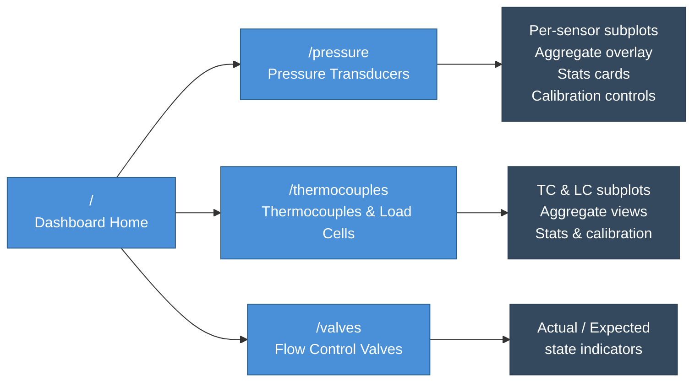
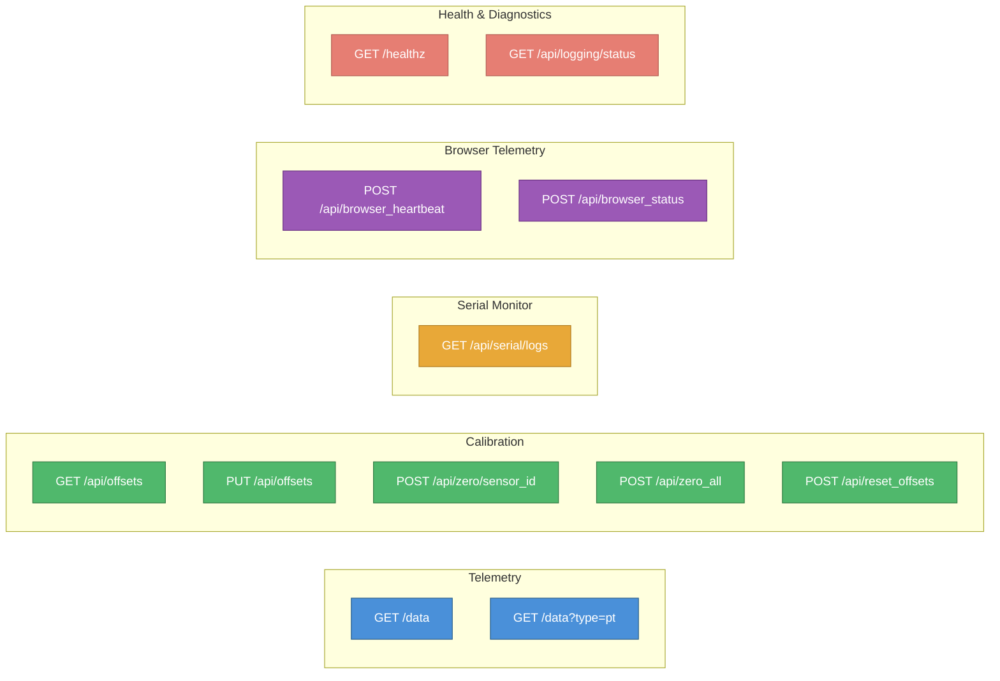
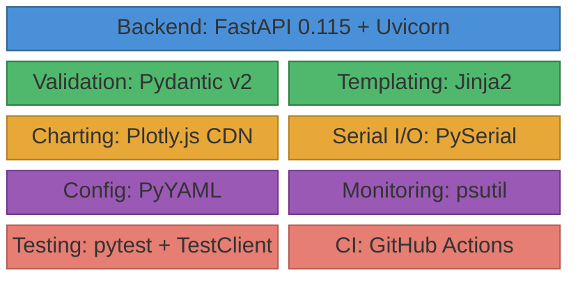

# RPL‑BLAST

**Big Launch Analysis & Stats Terminal** — a ground‑side web application for real‑time rocket sensor telemetry display, logging, and calibration.

BLAST reads data from either a built‑in simulator or a serial‑connected flight computer, applies calibration offsets, and serves live dashboards in the browser using Plotly charts. All data is logged to disk in JSONL and CSV formats for post‑run analysis.

> New to the project? Start with the onboarding guide: [ONBOARDING.md](ONBOARDING.md).

---

## Quick Start

### Step 1 — Get the Code

First, open your terminal (macOS) or PowerShell (Windows), navigate to where you want to store the project, and download the repository:

```bash
# Navigate to the folder where you want to store the project
cd C:/../<name-of-folder-for-project>

# Create a new directory for the project and move into it
mkdir rpl-blast
cd rpl-blast
```

Alternatively, you can use file explorer to create the file, then cd into it using the command line
```bash
cd C:/../rpl-blast
```

Now you can run this in your terminal. Make sure you have moved into the correct folder for this project.
```bash
# Clone the repository using Git
git clone https://github.com/rocketproplab/rpl-blast.git

# Move into the new project directory
cd rpl-blast
```

### Step 2 — Setup and Run

Choose the setup option below that best fits your environment.

#### Option A — One‑Click Scripts (No Python Required)

The scripts in `scripts/` use [micromamba](https://mamba.readthedocs.io/en/latest/user_guide/micromamba.html) to install a project‑scoped Python environment at `.venv`. No global changes are made.

**macOS**
```bash
# One‑time setup (downloads micromamba + creates .venv + installs deps)
scripts/Setup Mac.command

# Start the app
scripts/Start App.command
```
> If macOS blocks the scripts, run `bash scripts/fix_permissions_mac.sh` first.

**Windows**
```powershell
# One‑time setup
scripts\setup_win.bat

# Start the app
scripts\start_win.bat
```

**Uninstall** (removes `.venv` and the local micromamba — nothing global)
- macOS: `scripts/Uninstall Mac.command`
- Windows: `scripts\uninstall_win.bat`

### Option B — Manual Setup (Conda / pip)

```bash
# Create and activate a Conda environment
conda env create -f environment.yaml
conda activate RPL

# Or use pip directly in a venv
python -m venv .venv
.venv\Scripts\activate      # Windows
source .venv/bin/activate    # macOS / Linux
pip install -r requirements.txt
```

### Running the App

```bash
uvicorn backend.app.main:app --reload
```
Open **http://127.0.0.1:8000** in your browser.

You can customize the host and port via environment variables `HOST` and `PORT` when using the one‑click scripts.

### Setup Troubleshooting

If you run into issues getting the app to start:
- **macOS says "Permission denied":** Run `bash scripts/fix_permissions_mac.sh` in your terminal to unblock the scripts.
- **`FATAL: missing key` on startup:** Your `config.user.yaml` might be missing a required section or is malformed. Compare it against `config.base.yaml`.
- **Command not found (git/python):** Ensure Git and Python (3.9+) are installed and added to your system PATH.

---


## Dashboard Pages



Every page includes a **Serial Monitor** toggle button that opens an in‑page console showing raw data packets as they arrive.

---

## Configuration

BLAST uses a **layered configuration system**:

1. **`frontend/app/config.base.yaml`** — Base / shared settings (checked into git). Defines all sensor names, IDs, colors, value ranges, warning/danger thresholds, serial port defaults, and valve definitions.
2. **`frontend/app/config.user.yaml`** — User overrides (git‑ignored). Create this by copying `config.user.yaml.example`. Any keys here are deep‑merged on top of the base config.
3. **`frontend/app/config.ci.yaml`** — CI fallback config used by GitHub Actions.

### Key Config Fields

```yaml
data_source: "simulator"          # "simulator" or "serial"
serial_port: "COM4"               # e.g., "/dev/cu.usbmodem1301" on Mac
serial_baudrate: 115200

subpage1:
  pressure_transducers:           # List of {name, id, color, min_value, max_value, warning_value, danger_value}
subpage2:
  thermocouples: [...]
  load_cells: [...]
subpage3:
  flow_control_valves: [...]      # List of {name, id}
```

### Switching Data Sources

1. Create or edit `frontend/app/config.user.yaml`
2. Set `data_source: "simulator"` for testing or `data_source: "serial"` for real hardware
3. For serial mode, set the correct `serial_port` for your OS

---

## API Reference



---

## Project Structure

```mermaid
flowchart TD
    ROOT["rpl-blast/"] --> BACKEND["backend/"]
    ROOT --> FRONTEND["frontend/"]
    ROOT --> SCRIPTS["scripts/"]
    ROOT --> TOOLS["tools/"]
    ROOT --> GHCI[".github/workflows/ci.yml"]
    ROOT --> REQS["requirements.txt"]

    BACKEND --> BAPP["app/"]
    BACKEND --> BSTATE["state/calibration_offsets.yaml"]
    BACKEND --> BTESTS["tests/"]

    BAPP --> MAIN["main.py — App factory, reader loop, healthz"]
    BAPP --> VER["VERSION + version.py"]
    BAPP --> CONFIG["config/"]
    BAPP --> ROUTERS["routers/"]
    BAPP --> SCHEMAS["schemas/data.py — DataEnvelope"]
    BAPP --> SERVICES["services/"]
    BAPP --> LOGGING_PKG["logging/"]

    CONFIG --> LOADER["loader.py — Layered YAML config + Settings"]
    CONFIG --> PATHS["paths.py — Resolved FS paths"]

    ROUTERS --> RDATA["data.py — /data, /api/serial/logs"]
    ROUTERS --> RCALIB["calibration.py — /api/offsets, /api/zero"]
    ROUTERS --> RPAGES["pages.py — HTML page routes"]

    SERVICES --> DSRC["data_source.py — SimulatorSource, SerialSource"]
    SERVICES --> SCALIB["calibration.py — CalibrationStore + Service"]
    SERVICES --> CACHE["reading_cache.py — LatestReadingCache"]
    SERVICES --> SMON["serial_monitor.py — Ring buffer"]

    LOGGING_PKG --> LM["logger_manager.py — JSONL, CSV, run dirs"]
    LOGGING_PKG --> EL["event_logger.py — System events"]
    LOGGING_PKG --> SL["serial_logger.py — Serial I/O logs"]
    LOGGING_PKG --> PM["performance_monitor.py — Latency tracking"]
    LOGGING_PKG --> ER["error_recovery.py — Error health checks"]
    LOGGING_PKG --> FD["freeze_detector.py — Stall detection"]

    BTESTS --> T1["test_app_basic.py"]
    BTESTS --> T2["test_calibration_api.py"]

    FRONTEND --> FAPP["app/"]
    FRONTEND --> FLOGS["logs/ — Runtime logs per run"]

    FAPP --> CFGBASE["config.base.yaml — Sensor definitions"]
    FAPP --> CFGCI["config.ci.yaml"]
    FAPP --> CFGUSER["config.user.yaml.example"]
    FAPP --> LOGCFG["logging_config.yaml"]
    FAPP --> TEMPLATES["templates/"]
    FAPP --> STATIC["static/"]

    TEMPLATES --> TBASE["base.html — Layout shell"]
    TEMPLATES --> TIDX["index.html — Dashboard home"]
    TEMPLATES --> TPRESS["pressure.html — PT page"]
    TEMPLATES --> TTC["thermocouples.html — TC/LC page"]
    TEMPLATES --> TVALVE["valves.html — Valve page"]

    STATIC --> CSS["css/dashboard.css"]
    STATIC --> JS["js/ — 16 modules"]
    STATIC --> FONTS["fonts/"]

    JS --> JSDATA["get_data.js, calibration.js"]
    JS --> JSPT["pt_config, pt_line, pt_agg, pt_stats"]
    JS --> JSTC["tc_agg, tc_subplots, tc_stats"]
    JS --> JSLC["lc_agg, lc_subplots, lc_stats"]
    JS --> JSOTHER["valves, serial_monitor, browser_monitor"]

    SCRIPTS --> SMAC["Setup/Start/Uninstall Mac"]
    SCRIPTS --> SWIN["setup/start/uninstall Win"]

    TOOLS --> SMOKE["smoke_test_fastapi.py"]

    classDef backend fill:#4a90d9,stroke:#2c5f8a,color:#fff
    classDef frontend fill:#50b86c,stroke:#2f7a42,color:#fff
    classDef infra fill:#e8a838,stroke:#b07c20,color:#fff
    classDef logging fill:#9b59b6,stroke:#6c3483,color:#fff
    classDef tests fill:#e67e73,stroke:#b35a52,color:#fff
    classDef root fill:#34495e,stroke:#2c3e50,color:#fff

    class ROOT root
    class BACKEND,BAPP,MAIN,VER,CONFIG,LOADER,PATHS,ROUTERS,RDATA,RCALIB,RPAGES,SCHEMAS,SERVICES,DSRC,SCALIB,CACHE,SMON,BSTATE backend
    class LOGGING_PKG,LM,EL,SL,PM,ER,FD logging
    class BTESTS,T1,T2 tests
    class FRONTEND,FAPP,FLOGS,CFGBASE,CFGCI,CFGUSER,LOGCFG,TEMPLATES,TBASE,TIDX,TPRESS,TTC,TVALVE,STATIC,CSS,JS,JSDATA,JSPT,JSTC,JSLC,JSOTHER,FONTS frontend
    class SCRIPTS,SMAC,SWIN,TOOLS,SMOKE,GHCI,REQS infra
```



**Color legend:** 🟦 Backend  🟩 Frontend  🟪 Logging  🟥 Tests  🟨 Infrastructure

---

## Tech Stack



---

## CI / Testing

CI runs on every push/PR to `main` via `.github/workflows/ci.yml`:

1. **Install** — Python 3.9, pip deps from `requirements.txt` (cached)
2. **Smoke test** — `python tools/smoke_test_fastapi.py` (forces simulator mode via `FORCE_SIMULATOR_MODE=1`, exercises healthz, /data, calibration endpoints)
3. **Pytest** — `pytest -q backend/tests` (health, page routes, data shape, calibration CRUD)

### Running Tests Locally

```bash
# Smoke test
python tools/smoke_test_fastapi.py

# Unit tests
pytest -q backend/tests
```

---

## Logging System

BLAST has a comprehensive logging subsystem under `backend/app/logging/`:

- **LoggerManager** — Creates a timestamped run directory under `frontend/logs/`, writes JSONL data logs and CSV data logs, and produces a run summary on shutdown.
- **EventLogger** — Structured logging for system events (startup, shutdown, data source changes, state transitions).
- **SerialLogger** — Logs serial connection attempts, successes, failures, and per‑read results.
- **PerformanceMonitor** — Timer‑based latency measurement for data reads and API calls; tracks data lag.
- **ErrorRecovery** — Counts and categorizes errors; exposes a health check.
- **FreezeDetector** — Heartbeat‑based watchdog that detects stalled loops (data acquisition, serial communication, API requests).

All diagnostics are queryable at runtime via `GET /api/logging/status`.

---

## Troubleshooting

| Problem | Fix |
|---------|-----|
| Serial port not found | Check `serial_port` in your `config.user.yaml`. On Mac, look for `/dev/cu.usbmodem*`; on Windows, check Device Manager for the COM port. |
| macOS blocks scripts | Run `bash scripts/fix_permissions_mac.sh` |
| `FATAL: missing key` on startup | Your config file is missing a required section. Compare against `config.base.yaml`. |
| Data shows all zeros | You may be in serial mode with no hardware connected. Switch to `data_source: "simulator"`. |
| Calibration file write errors | Check filesystem permissions on `frontend/logs/`. OneDrive‑synced folders can cause atomic‑write failures (the app falls back to direct writes). |

---

## License

MIT — see [LICENSE](LICENSE).
